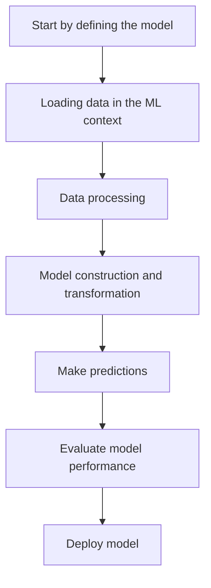

# Setup .NET 10 for AI Development

## Steps to configure project

Considering that you have .NET 10 SDK and IDE like Visual Studio, Rider or VSCode installed, just add ML.NET (Nuget Package)

```bash
dotnet --version

dotnet add package Microsoft.ML
```

## Building a Simple Machine Learning Model

1. Define a data model
2. Load the data
3. Build the model
4. Make predictions
5. Running the model

A simple chart to understand the flow is...



### Practical example

```csharp
// 1 - Define model

public class StudentData
{
    public float StudyHours { get; set; }
    public float PreviousGrade { get; set; }
    public float FinalGrade { get; set; }
}

public class StudentPrediction
{
    public float Score { get; set; }
}

```

```csharp
// 2 - Load the data

var data = new List<StudentData>
{
    new() { StudyHours = 4, PreviousGrade = 4.0f, FinalGrade = 5.5f },
    new() { StudyHours = 4, PreviousGrade = 5.5f, FinalGrade = 6.5f },
    new() { StudyHours = 6, PreviousGrade = 6.5f, FinalGrade = 7.0f },
    new() { StudyHours = 8, PreviousGrade = 7.5f, FinalGrade = 8.0f },
    new() { StudyHours = 10, PreviousGrade = 8.5f, FinalGrade = 9.0f },
};

var context = new MLContext();
var dataView = context.Data.LoadFromEnumerable(data);

// 3 - Build the model

var pipeline = context.Transforms
    .Concatenate("Features", inputColumnNames: ["StudyHours", "PreviousGrade"])
    .Append(context.Regression.Trainers.Sdca(
        labelColumnName: "FinalGrade",
        maximumNumberOfIterations: 100));

var model = pipeline.Fit(dataView);

// 4 - Make predictions

var predictionEngine = context.Model
    .CreatePredictionEngine<StudentData, StudentPrediction>(model);

var prediction = predictionEngine.Predict(new StudentData
{
    StudyHours = 7,
    PreviousGrade = 7.0f
});
    
// 5. Running the model

Console.WriteLine($"Predicted final grade: {prediction.Score:F1}");
```

### Concepts and practice

#### 1. Define model

This is the C# representation of the data that the model will use. Each property has a role:
* **Features (StudyHours, PreviousGrade)** — these are the inputs, the information provided for the model to learn and make predictions.
* **Label (FinalGrade)** — this is the output, the value you want the model to learn to predict.
* **Types matter**: ML.NET expects float for regression, bool for binary classification.

#### 2. Load the data

* **MLContext** — is the entry point for everything in ML.NET, equivalent to a "session". It manages pipelines, trainers, transformations, and evaluations. There should only be one instance per application.
* **IDataView** — is the internal format that ML.NET uses for data. It works as a lazy and optimized view on top of your list. It can come from an in-memory list, CSV, database, or any other source.

#### 3. Build the model

This is the most complex stage—composed of three concepts:

* **Concatenate** — transforms the individual features (StudyHours, PreviousGrade) into a single vector called "Features". ML.NET requires this format to feed the trainer.
* **Trainer (Sdca, SdcaLogisticRegression)** — is the learning algorithm. It defines how the model will adjust its internal parameters to minimize error.
* **Fit()** — is where the actual learning happens. The model processes the data, adjusts the weights, and returns a trained ITransformer.

#### 4. Make predictions

* **PredictionEngine** — is an optimized wrapper for one-to-one predictions, ideal for APIs and interactive apps. For batch predictions, use model.Transform(dataView)
* **Prediction class (StudentPrediction)** — the result never returns to the same input class. For Regression, the field is Score (float); for Binary Classification, they are PredictedLabel (bool), Probability, and Score
* **Predict()** — applies all pipeline transformations to the new data and returns the result

#### 5. Running the model

In practice, this step has two sub-moments:

* **Evaluation** — measuring the quality of the model on the training data or on a separate test set. For Regression, metrics such as RS-squared and RMSE are used; for Classification, Accuracy and AUC are used.
* **Consumption** — actually using the model, displaying or returning predictions to the end user.

### Overview

| Step | What it is | Key Class/Method |
|---|---|---|
| 1 - **Data model** | Data structure definition | POCO with `float`/`bool` + Prediction class |
| 2 - **Load data** | Session + data ingestion | `MLContext`, `IDataView` |
| 3 - **Build model** | Pipeline + training | `Concatenate`, `Fit()` |
| 4 - **Predictions** | Single prediction | `PredictionEngine`, `Predict()` |
| 5 - **Running** | Evaluation + output | `Evaluate()`, output |

### Inside the code

#### What is a Trainer?

The trainer is the learning algorithm. It defines how the model adjusts its internal parameters when processing the training data, trying to minimize the error between, what it predicted and what the correct value was.
In ML.NET, the trainer is always associated with a type of task — and that's where Regression and BinaryClassification come in.

#### Task Types
The choice of task type depends on a single question: what format do you want for the answer?

**Regression** — "How much?"
- Used when the answer is a continuous number, with no limit on values.

| Question                                  | Label |
|-------------------------------------------| ----- |
| What will the student's final grade be?   | float FinalGrade |
| What is the sale price of this property? |  float Price |
| How many hours will this project take? | float Hours | 

```csharp
context.Regression.Trainers.Sdca(labelColumnName: "FinalGrade")
```

The model learns to plot a "curve" that passes as close as possible to all data points.

**BinaryClassification** — "Yes or no?"
- Used when the answer is a choice between two states.

| Question                                  | Label |
|-------------------------------------------| ----- |
| Will the student be approved? | bool Approved |
| Is the email spam? | bool IsSpam |
| Will the client cancel the plan? | bool WillChurn |

```csharp
context.BinaryClassification.Trainers.SdcaLogisticRegression(labelColumnName: "Approved")
```

The model learns to draw a decision boundary between the two groups — on one side the true, on the other the false.

**MulticlassClassification** — "Which category?"
- When the answer is not yes/no, but one among several options.

| Question                                  | Label |
|-------------------------------------------| ----- |
| What type of flower is this? | string FlowerType |
| What is the sentiment of the text? | string Sentiment |
| Which digit is in the image? | uint Digit |

How to decide which one to use
```
Is the answer a continuous number? → Regression
Is the answer yes or no? → BinaryClassification
Is the answer one among several categories? → MulticlassClassification
```

A practical way to test: try completing the sentence with the expected answer. 

* "The final grade will be __" → any number is possible → **Regression**
* "Will the student pass? __" → only yes or no is possible → **BinaryClassification**
* "The type of flower is __" → one of several options is possible → **Multiclass**

### Why does SDCA in Regression and BinaryClassification?

You should know that the name SDCA can be used in both Regression and BinaryClassification. 
This is because SDCA is the underlying mathematical optimization algorithm — what changes is how it is applied:

| Task                                         | Trainer                 | What it does internally |
|----------------------------------------------|-------------------------| ----------------------- |
| Regression | Sdca | Minimizes quadratic error (distance to the true value) |
| BinaryClassification |  SdcaLogisticRegression | Minimizes the probability of misclassification |

### Before writing the pipeline, answer:
* What do I want to predict?
* What is the label type?
  * float → Regression
  * bool → BinaryClassification
  * string → MulticlassClassification
